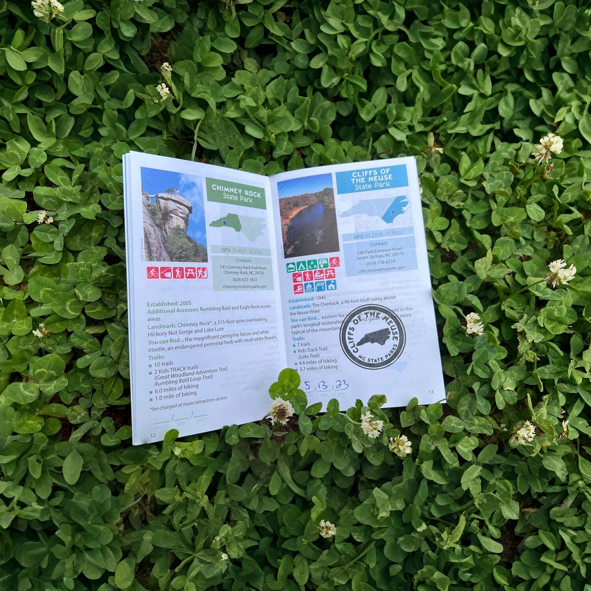
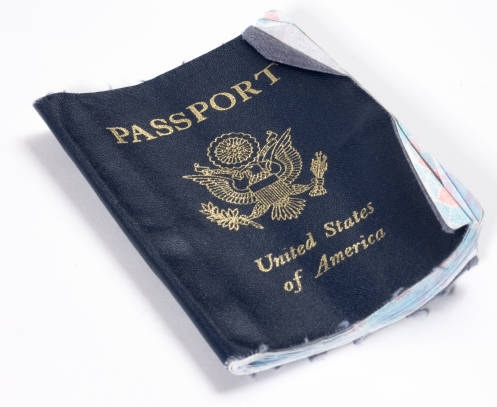

# OPR1: NC Parks & Rec
       
### Team 21
###### Jake Elliot, Vivek Mehra, Hitesh Vuligonda, Lane Weaver, Adam Wett

---

#### North Carolina Department of Parks and Recreation (NCDPR)
- Service 19m+ visitors / year
- Preserve over 262,000 acres of land
	- 41 state parks, 25+ lakes, trails, rivers, and other natural areas

#### Application Systems Program
- Build digital tools to support operations, planning, and park services
- Collaborate with students to build real-world software

<!--
ADAM: 
So a bit about our sponsor. NCDPR was established in 1916 and has since grown to preserve over 262 thousand acres of land, including 41 parks, and more than 25 other natural areas adored by Carolinians. 
-->

---

# Paper Passport
- Visitors can recieve a unique stamp at each park
- Visitors rely on passport for information
- Passports are printed and distributed by NCDPR

---

# Paper Problem
- Printing and distributing passports costs $$
- Passports are frequently lost or damaged
	- Progress is untransferable 😔
- Updating information is expensive and slow
	- Some parks have poor cell service
	- Visitors forced to rely on old info

---

# PWA Solution
- NCDPR build a progressive web app to replace the paper passport
- No reversion from paper functionality
	- View park information entirely offline
	- Add personal notes to parks
- Additional features not possible with paper
	- Merging passport progress
	- Interactive map
	- Community notes

---