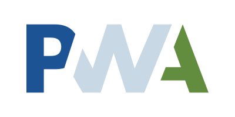

# OPR1: NC Parks & Recreation 2

### Digital Passport Application

    

### Team 21

###### Jake Elliot, V Mehra, Hitesh Vuligonda, Lane Weaver,   & Adam Wettreich (speaking)

---

# Agenda

- Background & Problem Summary
- Project Goals & Benefits
- Requirements
- System Design & Wireframes
- Risks & Mitigation
- Resources Needed
- Team Member Contributions
- Action Steps

---

#### North Carolina Department of Parks and Recreation (NCDPR)

- Service 19m+ visitors / year
- Preserve over 262,000 acres of land
  - 41 state parks, 25+ lakes, trails, rivers, and other natural areas

#### Application Systems Program

- Build digital tools to support operations, planning, and park services
- Collaborate with students to build real-world software

<!--

So a bit about our sponsor. NCDPR was established in 1916 and has since grown to preserve over 262 thousand acres of land, including 41 parks, and more than 25 other natural areas adored by Carolinians.

Within this division, the Application Systems Program is responsible for building digital tools to support operations, planning, and park services. They work with students to design & build these systems.

-->

---

# Park Passport

- Visitors recieve a unique stamp from each park
- Contains information, trails, trivia, and more
- Passports are printed and distributed by NCDPR

<!--

So NCDPR prints out these cute little paper passports, and visitors love collecting stamps from each of the parks they visit as a little memento.

-->

---

# More paper, more problems

- Printing and distributing passports costs $$
- Updating information is expensive and slow
- Passports are frequently lost or damaged
  - Progress is lost 😢

<!--

Unfortunately, printing and distributing passports costs beaucoup bucks. Not to mention every time the information needs to be updated, you have to print and distribute all of the passports again. Also, visitors complain about losing their passports or having them damaged and are upset that they lose all of their progress getting each of the stamps.

-->

---

# Solution

- Build a digital mobile app to replace the paper passport

#### Why?

- Significantly reduces operational costs
- Expands features and capabilities
- Provides a more engaging and interactive experience
- Enables analytics and visitor insights

<!--  -->

<!--

So we're building a digital mobile app to replace the paper passport. It costs way less to maintain and update and visitors will never have to worry about damaging or losing their passport.

Plus, an app can do some fun things that just aren't possible on paper, and of course some more practical things like tracking visits and providing analytics.

-->

---

# Sponsor Requirements

PWA Frontend

- Works offline
- Looks the same as the paper passport
- Has everything the paper passport has

Dockerized Backend

- MariaDB database
- Custom auth

<!--

In our initial meeting, we were given a list of requirements for the project.
First off, it's gotta be a PWA. It needs to work offline and use the same design language as the paper passport. And it can't be less useful than the paper passport, so it needs to include all of the original features.

For our backend they wanted it all rolled up into a Docker container, and told us we needed to use MariaDB. They also requested that we roll our own auth.

But besides that they were pretty open to any design decisions we made.

-->

---

<!--

So here's a diagram of the design we came up with. On the frontend we're using React with TypeScript. We're using Tanstack Query to manage the state of the app, and that's cached locally to make it work offline.

The backend is written in C# with .NET and uses Entity Framework to interact with the MariaDB database. Pretty standard Controller/Service/Repository pattern going on here. And again all of this down here is running inside a Docker container.

-->

---

# Wireframe  Walkthrough

 

---

##   

---

  

---

  

---

  

---

# Iteration 1 Progress

- Vite project setup
- Installable PWA
- Some wireframes
- Stamp location detection
- Tanstack Query state hooks
- Caching to local storage
- MariaDB migrations
- Component snapshot testing

<!--

As of right now for iteration 1 we've implemented a lot of the frontend. We have a Vite project setup, we've got the PWA working, and we've got a few of the wireframes implemented. We've also got a prototype of the stamp feature working. Our state management is handled with Tanstack Query, and the offline caching is working as well. On Monday, we just setup our MariaDB database and started working on the backend. For testing we just have some Jest snapshot tests

-->

---

# Resources Needed

<table>
  <tr>
    <th>Backend</th>
    <th>Frontend</th>
  </tr>
  <tr>
    <td>
      • C# 
      • .NET 
      • Entity Framework 
      • MariaDB 
      • Docker 
      • AWS
    </td>
    <td>
      • React 
      • TypeScript 
      • Tanstack Query 
      • React Router 
      • Tailwind CSS 
      • Vite
    </td>
  </tr>
</table>

<!--

Here's a more exhaustive list of the resources and technologies we'll need. Not previously mentioned is Vite as our local development server & bundler, React Router for routing, and of course styling with Tailwind CSS.

-->

---

| Name   | Contributions                                                                     |
| ------ | --------------------------------------------------------------------------------- |
| Jake   | • Wireframes, UI/UX Design  • Primary writer for preliminary requirements     |
| Hitesh | • Formalized requirements documentation • Primary writer for OPR presentation |
| V      | • Backend architecture planning • Technology stack decisions                  |
| Lane   | • Requirements progress reporting • Ground rules development & inforcement    |
| Adam   | • PWA codebase setup • Database schema design                                 |

<!--

So far we've all been contributing pretty evenly and working well together.

Jake spearheaded getting the wireframes done and doing most of the heavy lifting writing the requirements. Hitesh has been keeping track of our progress and did a lot of the writing for this presentation. V has been helping us plan out the backend architecture and calling the shots on our tech stack. Lane has been keeping us on track, making sure we're all pulling our weight, and conforming to the requirements. And for myself I've mostly handled gluing the frontend together and designing a schema that balances bias between the frontend and backend.

-->

---

# Action Items

- Implement remaining wireframes
- Create low level design (backend)
- User authentication
- System test plan (preferably automated)

<!--

For the rest of iteration 1, we're going to be implementing the remaining wireframes, creating a low level design for the backend, and have fully functioning auth. We still need to figure out how exactly we're going to be testing this thing, and we'd like it to be as automatic as possible. Our deadline for all of this is February 12th, which marks the end of Iteration 1.

And with that comes the end of our presentation. Thank you for listening!

-->
